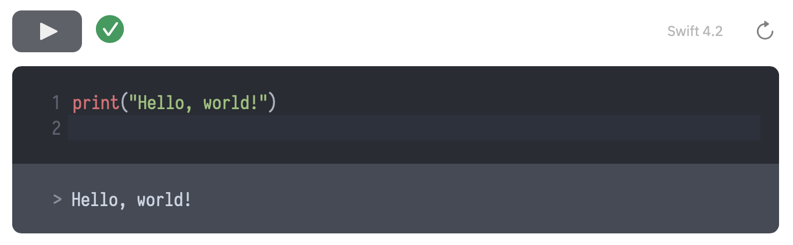

<p align="center">
    <a href="https://vapor.codes">
        
    </a>
    <br>
    <br>
    <a href="https://vapor.codes">
        
    </a>
    <a href="https://swift.org">
        
    </a>
    <a href="LICENSE">
        
    </a>
</p>

## Overview

A simple [Vapor](https://vapor.codes) provider for creating server-side Swift Playgrounds.

MicroPlaygroundProvider creates a websocket server that can accept Swift source code and return Swift build output text to a client.

<p align="center">
<a href="https://hal.codes"></a>
</p>

## Installation

Add this dependency to your `Package.swift`:

```swift
dependencies: [
    .package(url: "https://github.com/hallee/micro-playground-provider.git", from: "0.1"),
],
```

And add `"MicroPlaygroundProvider"` as a dependency to your app's target.

## Setup

In `configure.swift`:

```swift
import MicroPlaygroundProvider
```
```swift
try services.register(MicroPlaygroundProvider())
```

By default, MicroPlaygroundProvider creates a websocket server at the path `/playground`.

### Toolchains

MicroPlaygroundProvider expects a Swift toolchain in your Vapor project's path at `./Toolchains/`.
You can download the latest toolchain using this script:

```bash
SWIFT_VERSION=4.2
BRANCH=release
RELEASE=RELEASE
if [[ `uname` == 'Darwin' ]]; then
   SWIFT_TARGET=osx
else
   SWIFT_TARGET=ubuntu16.04
fi

case "$SWIFT_TARGET" in
*osx)
    mkdir -p Toolchains/swift-$SWIFT_VERSION-$RELEASE.xctoolchain
    # download
    curl -O https://swift.org/builds/swift-$SWIFT_VERSION-$BRANCH/xcode/swift-$SWIFT_VERSION-$RELEASE/swift-$SWIFT_VERSION-$RELEASE-$SWIFT_TARGET.pkg
    # extract
    xar -xf swift-$SWIFT_VERSION-$RELEASE-$SWIFT_TARGET.pkg -C Toolchains/
    tar -xzf Toolchains/swift-$SWIFT_VERSION-$RELEASE-$SWIFT_TARGET-package.pkg/Payload -C Toolchains/swift-$SWIFT_VERSION-$RELEASE.xctoolchain
    # cleanup
    rm Toolchains/Distribution
    rm -r Toolchains/swift-$SWIFT_VERSION-$RELEASE-$SWIFT_TARGET-package.pkg
    rm -r swift-$SWIFT_VERSION-$RELEASE-$SWIFT_TARGET.pkg
    ;;
ubuntu*)
    mkdir -p Toolchains/swift-$SWIFT_VERSION-$RELEASE.xctoolchain
    # download
    curl -O https://swift.org/builds/swift-$SWIFT_VERSION-$BRANCH/ubuntu1604/swift-$SWIFT_VERSION-$RELEASE/swift-$SWIFT_VERSION-$RELEASE-$SWIFT_TARGET.tar.gz
    # extract
    tar -xvzf swift-$SWIFT_VERSION-$RELEASE-$SWIFT_TARGET.tar.gz -C Toolchains/swift-$SWIFT_VERSION-$RELEASE.xctoolchain --strip-components=1
    # cleanup
    rm -rf swift-$SWIFT_VERSION-$RELEASE-$SWIFT_TARGET.tar.gz
    ;;
esac
```

## Usage

Once you've set up MicroPlaygroundProvider on your server, you can use the [WebSocket API](https://developer.mozilla.org/en-US/docs/Web/API/WebSockets_API) directly without any Javascript client libraries.

For example: 

```js
socket = new WebSocket('wss://' + location.host + '/playground') // ws:// for non-https sites

socket.onopen = function () {
  socket.send('print("Hello, world!")')
}

socket.onmessage = function (event) {
  var response = JSON.parse(event.data)
  if (response.hasOwnProperty('error') && response.hasOwnProperty('text')) {
    console.log(response.text + response.error) // Hello, world!
    if (response.error != '') {
      // error
    } else {
      // success
    }
  }
}
```